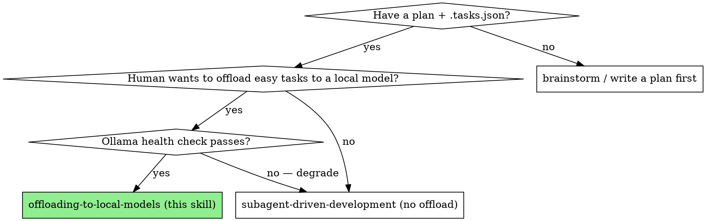
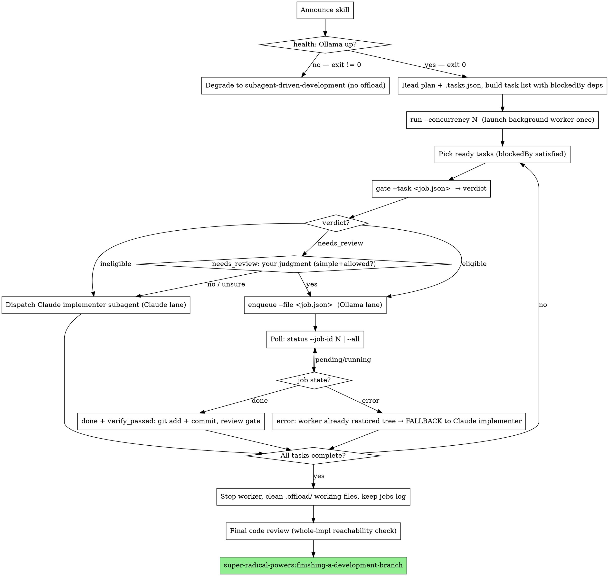

# Offloading to Local Models

Execute an implementation plan exactly like `super-radical-powers:subagent-driven-development`, but route the *simple, self-contained, verifiable* tasks to a local Ollama model running in a background worker — in parallel with Claude's work on the hard tasks. The local worker writes the files and runs each task's `verifyCommand` itself, so Claude spends near-zero tokens on offloaded tasks. Every offloaded result is gated by its own verify; on any failure it falls back to a normal Claude implementer subagent.

**This is an opt-in variant, not a replacement.** It does NOT fork `subagent-driven-development` — it *reuses* it for the Claude lane and for every review gate. If you do not have a working local Ollama, you are doing plain subagent-driven-development. Offload is a $0 add-on lane, never a corner you cut.

**Core principle:** Swap the expensive implementer's generation tokens for Ollama's $0 — and reuse the review gates already in place as the safety net. The local model is fast and free but weak: it hallucinates APIs confidently with no uncertainty signal. **The verify run is the only thing standing between its output and your codebase.** Trust nothing it says about its own work.

## When to Use

Use this INSTEAD of `subagent-driven-development` only when ALL of these hold:
- You have a written implementation plan with `.tasks.json` (same input as subagent-driven-development).
- Your human partner explicitly wants to offload work to a local model to save API tokens.
- A local Ollama instance is reachable.

If the local model is unreachable, or your human partner has not asked to offload, use `super-radical-powers:subagent-driven-development` directly. This skill degrades to exactly that.



## The Two-Lane Scheduler

You are the orchestrator. You walk the plan's task DAG and route each *ready* task (its `blockedBy` satisfied) through an eligibility gate into one of two lanes that advance **concurrently**:

- **Claude lane** — hard / ineligible / fallback tasks, dispatched to implementer subagents *exactly* as `subagent-driven-development` does, including its two-stage review gates (spec compliance, then code quality) and `.tasks.json` sync.
- **Ollama lane** — eligible tasks enqueued as jobs to a local SQLite queue. The background worker pulls each job, calls Ollama for whole-file generation, atomic-writes the files, and runs the task's `verifyCommand` — all without spending Claude tokens.

Parallelism is real: while a Claude implementer subagent grinds on a hard task, the worker is already churning the GPU on the easy ones. The Ollama lane obeys the **same `blockedBy` + disjoint-file-ownership discipline as subagent-driven-development's parallel waves** — treat it as a "$0 local wave."

All commands below take the form (run from the repo root):

```
python skills/offloading-to-local-models/offload_worker.py --project <repo-root> <subcommand>
```



## The Loop, Step by Step

### 1. Announce + health check (graceful degradation)

Announce you are using `offloading-to-local-models`. Then probe Ollama:

```
python skills/offloading-to-local-models/offload_worker.py --project <repo-root> health
```

- **Exit 0** → Ollama is up. Proceed.
- **Exit non-zero** → Ollama is DOWN. Announce that you are degrading to plain `super-radical-powers:subagent-driven-development` (no offload) and execute the plan with that skill instead. **Never block the plan because the local model is unavailable.**

### 2. Build the task list

Read the plan and `<plan-path>.tasks.json`. Build the task list with `blockedBy` dependencies — identical to `subagent-driven-development`. This is the DAG you will walk.

### 3. Launch the background worker (once)

Start the worker as a **backgrounded Bash run** so it drains the queue while you keep working. Use `concurrency` from `.offload/config.json` (default `1`; a 16GB GPU supports up to `2`):

```
python skills/offloading-to-local-models/offload_worker.py --project <repo-root> run --concurrency <N>
```

Launch it once. The worker claims pending jobs, calls Ollama, writes files, runs verify, and either records a `done` result or restores the tree and records an `error`. It exits on its own after the queue is idle.

### 4. Route each ready task through the gate

For each ready task (its `blockedBy` satisfied), write the task metadata to a small job JSON file (`task_id`, `model` optional, `target_files`, `spec`, `verify_command`, plus any `category`/`offload_eligible` hint from the plan), then ask the gate:

```
python skills/offloading-to-local-models/offload_worker.py --project <repo-root> gate --task <job.json>
```

It prints `{"verdict": "...", "reason": "..."}`. Route on the verdict:

- **`eligible`** → enqueue it (Ollama lane):
  ```
  python skills/offloading-to-local-models/offload_worker.py --project <repo-root> enqueue --file <job.json>
  ```
  This prints the new job id. Record it against the task.
- **`ineligible`** → dispatch a Claude implementer subagent (Claude lane), exactly as `subagent-driven-development` does. The gate has mechanically blocked this task (no verify, multi-file, modify-too-large, or an excluded category). **Do not override it.**
- **`needs_review`** → **your judgment.** The category is unknown. Offload it ONLY if it is a genuinely simple, self-contained artifact in an allowed category — boilerplate, config/fixtures, format conversion (e.g. JSON↔YAML), docstrings, test scaffolds, or a standalone utility/regex. Otherwise route it to the Claude lane. **When unsure, choose the Claude lane.** A wrong offload costs a verify + fallback; a wrong Claude-lane choice costs only tokens.

**Disjoint-file ownership (non-negotiable).** Never let an offloaded job and a concurrent Claude-lane task — or two concurrent offloaded jobs — write the same file. Before enqueuing, confirm the task's `target_files` overlap no other in-flight work. If they overlap, serialize: wait for the conflicting lane to finish, or route to the Claude lane. Same discipline as subagent-driven-development's parallel waves.

### 5. Poll offloaded jobs; commit on pass, fall back on error

Poll job status:

```
python skills/offloading-to-local-models/offload_worker.py --project <repo-root> status --job-id <N>
# or, to sweep all jobs:
python skills/offloading-to-local-models/offload_worker.py --project <repo-root> status --all
```

The `status` JSON field is one of `pending`, `running`, `done`, or `error`.

- **`done` with `verify_passed: 1`** → the worker already wrote the files (listed in `files_written`) AND ran the task's `verifyCommand` successfully. The work is real and verified. Just `git add` those files and commit, then run a review gate. Because this code passed its own verify and came from a constrained category, a lighter single-pass spec+quality review is acceptable; do not skip review entirely.
- **`error`** → verify failed, the model errored, or Ollama choked. The worker has **already restored the tree** (the files are back to their pre-job state — nothing half-written is left behind). **Fall back:** dispatch a Claude implementer subagent for that task, exactly as `subagent-driven-development` does. A failed offload is never left half-done and is never integrated.

**Sync `.tasks.json` after every status change** — mark each task `completed` (offloaded-and-verified, or Claude-implemented-and-reviewed) and update `lastUpdated`, same as `subagent-driven-development`. This keeps cross-session resume correct.

### 6. Continue until all tasks complete

Keep both lanes advancing until every task is done. Then stop the worker, clean the `.offload/` working files (the per-run job JSONs and `queue.db` WAL artifacts), but **keep the jobs log rows** — they record which task types were actually worth offloading (token/latency/verify-pass data for tuning).

### 7. Final review + finish the branch

Dispatch the final code reviewer for the **entire** implementation, including the end-to-end wiring / reachability check (offloaded artifacts are easy to build and never wire up — trace them from a real entry point). Then hand off to `super-radical-powers:finishing-a-development-branch`.

## Non-Negotiable Safety Rules

These are the hard rules. They exist because local 7B–32B models fail in specific, well-documented ways. Do not relax them under pressure.

1. **NEVER integrate offloaded output that did not pass its verify.** The local model produces confident-wrong code with no uncertainty signal. The verify run is the ONLY gate. Ignore the model's self-reported `confidence` field — it is decorative, not evidence.
2. **Whole-file generation only — never diffs.** Local models fail at surgical diff edits; this is the single most-documented failure mode. Never route a diff-edit / surgical-patch task to the Ollama lane. Offloaded tasks produce a complete file, or they go to Claude.
3. **Never offload hard-excluded work:** correctness-critical / algorithmic logic, security-sensitive code, multi-file refactors, architecture / design / trade-off work. The gate blocks these mechanically (`ineligible`). You must not override the gate to force them through.
4. **If Ollama is unreachable, degrade to plain subagent-driven-development.** Never block, stall, or fail the plan because the local model is down.
5. **Every failure falls back to Claude.** A failed offload is never left half-done — the worker restores the tree first, then you dispatch a Claude implementer for that task.

## Red Flags

**Never:**
- Integrate or commit offloaded files whose job is not `done` with `verify_passed` (NEVER trust unverified local output)
- Trust the model's `confidence` field instead of the verify result ("it said high confidence" is not a gate)
- Route a diff / surgical-edit task to the Ollama lane (whole-file only)
- Override an `ineligible` gate verdict to force a hard task onto the local model
- Offload correctness-critical, security-sensitive, algorithmic, multi-file, or architecture work
- Let an offloaded job and a concurrent task (Claude-lane or another job) write the same file
- Enqueue a `needs_review` task you are unsure about — when unsure, choose the Claude lane
- Block the plan because Ollama is down — degrade to plain subagent-driven-development instead
- Skip the review gate on offloaded code because "verify already passed" (verify ≠ review)
- Leave a failed offload half-applied (the worker restores; you fall back to a Claude implementer)
- Skip the final whole-implementation reachability check (offloaded artifacts are easy to leave unwired)

**Rationalizations to reject:**
- "It's a simple file, just trust it" → simple or not, no integration without a passing verify
- "The model said confidence: high" → confidence is self-reported and unreliable; only verify counts
- "It's basically a one-line diff, the local model can handle it" → diffs are the dominant failure mode; whole-file or Claude
- "Ollama is down but I'll just wait / retry in a loop" → degrade to plain subagent-driven-development and proceed
- "The gate said ineligible but this one's easy" → the gate is mechanical and correct; route it to Claude

## What "lighter review" means (and does not)

An offloaded task that reaches `done` with `verify_passed` has already had its `verifyCommand` run by the worker, so you may collapse the two-stage review into a single spec+quality pass for local-origin code. It does NOT mean *skipping* review. Spec compliance (did it build the right thing, nothing extra?) and code quality still apply — verify proves the tests pass, not that the code is right or clean. Claude-lane tasks keep the full two-stage review unchanged.

## Integration

**Required sub-skill (the spine of this workflow):**
- **super-radical-powers:subagent-driven-development** — REQUIRED. Provides the Claude lane (implementer dispatch), the two-stage review gates, the final whole-implementation reachability review, and `.tasks.json` sync. This skill adds only the Ollama lane and the scheduler on top of it.

**Also used:**
- **super-radical-powers:using-git-worktrees** — set up an isolated workspace before starting (inherited from subagent-driven-development).
- **super-radical-powers:writing-plans** — creates the plan (with optional `offloadEligible` hints) that this skill executes.
- **super-radical-powers:finishing-a-development-branch** — run ONCE at the very end, after the final review, when every task is complete.

**Degradation target:**
- **super-radical-powers:subagent-driven-development** — when Ollama is unreachable, execute the plan with this directly (no offload lane).
